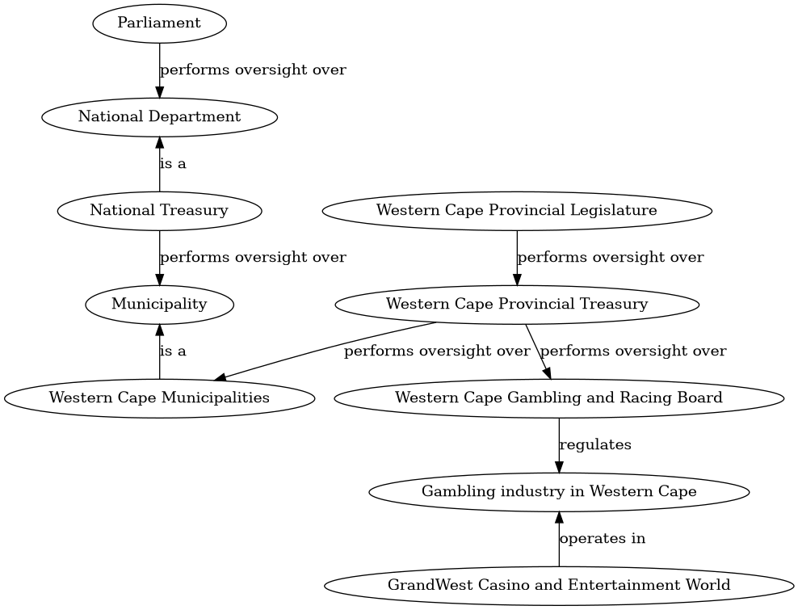

# Who watches whom

This represents the exploration of oversight and governance in South Africa.

I'm not sure where this is going, but some questions that I think clear answers
are needed for questions like

> Who watches over the state security agency?

> What power do they have to step in if there is misconduct?

> How is misconduct defined?

> If whoever is supposed to be watching over them doesn't hold them to account,
  who can step in? Who watches the watcher?

> What are our next steps as concerned members of the public?

To explore this, I'm using a diagramof the concepts, entities and relations in
this system, with a Web Ontology style in mind.

## Collaboration

If you're interested in collaborating on this, [email](mailto:jbothma@gmail.com) or [tweet](twitter.com/jdbothma) me.

## Editing the diagram

The diagram is definted by the GraphViz dot file [graph.dot](graph.dot).

You can update it after edits by running `make`.
